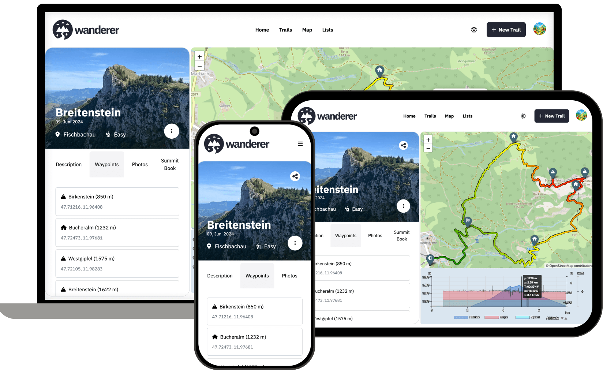

<!--
Nota bene : ce README est automatiquement généré par <https://github.com/YunoHost/apps/tree/master/tools/readme_generator>
Il NE doit PAS être modifié à la main.
-->

# Wanderer pour YunoHost

[](https://ci-apps.yunohost.org/ci/apps/wanderer/)


[](https://install-app.yunohost.org/?app=wanderer)

*[Lire le README dans d'autres langues.](./ALL_README.md)*

> *Ce package vous permet d’installer Wanderer rapidement et simplement sur un serveur YunoHost.*  
> *Si vous n’avez pas YunoHost, consultez [ce guide](https://yunohost.org/install) pour savoir comment l’installer et en profiter.*

## Vue d’ensemble

Wanderer est une base de données de sentiers auto-hébergée. Vous pouvez télécharger vos traces enregistrées ou en créer de nouvelles et ajouter diverses métadonnées pour constituer un catalogue facilement consultable.

- Gérez vos sentiers
- Planifier de nouveaux itinéraires
- Intégration et visualisation de cartes étendues
- Partagez vos sentiers avec d'autres personnes et explorez les leurs
- Fonctionnalité avancée de filtrage et de recherche
- Créez des listes personnalisées pour mieux organiser vos itinéraires


**Version incluse :** 0.13.2~ynh3

**Démo :** <https://demo.wanderer.to/>

## Captures d’écran



## Documentations et ressources

- Site officiel de l’app : <https://wanderer.to/>
- Documentation officielle utilisateur : <https://wanderer.to/>
- Documentation officielle de l’admin : <https://wanderer.to/getting-started/installation/>
- Dépôt de code officiel de l’app : <https://github.com/Flomp/wanderer>
- YunoHost Store : <https://apps.yunohost.org/app/wanderer>
- Signaler un bug : <https://github.com/YunoHost-Apps/wanderer_ynh/issues>

## Informations pour les développeurs

Merci de faire vos pull request sur la [branche `testing`](https://github.com/YunoHost-Apps/wanderer_ynh/tree/testing).

Pour essayer la branche `testing`, procédez comme suit :

```bash
sudo yunohost app install https://github.com/YunoHost-Apps/wanderer_ynh/tree/testing --debug
ou
sudo yunohost app upgrade wanderer -u https://github.com/YunoHost-Apps/wanderer_ynh/tree/testing --debug
```

**Plus d’infos sur le packaging d’applications :** <https://yunohost.org/packaging_apps>
